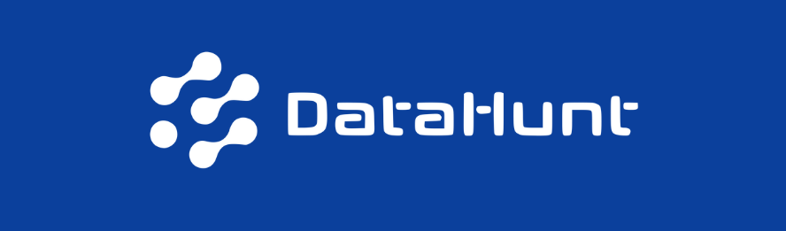

# 🔎 DataHunt - Projeto de Engenharia de Software

Este é um repositório destinado ao projeto DataHunt, cujo objetivo é aplicar conceitos e conteúdos vistos ao longo da disciplina de Engenharia de Software do Centro de Informática (CIn) da Universidade Federal de Pernambuco (UFPE).



Neste repositório, é possível encontrar os códigos desenvolvidos ao decorrer do projeto e também informações relevantes sobre o projeto, como quem são os autores do projeto, quais são as tecnologias utilizadas, etc.

------

## Escopo

O projeto consiste em desenvolver uma ferramenta de extração de metadados que possa ser usada pelo Laboratório História e Memória (LAHM) da UFPE. Atualmente, o LAHM conta com mais de 100.000 documentos que passarão por um processo de digitalização e catalogação das informações. Tendo em vista que o processo de catalogação das informações ocorre de maneira manual, nosso propósito é desenvolver uma solução que facilite a extração, organização e acesso aos metadados dos processos digitalizados. Para uma versão inicial do produto, a solução desenvolvida será focada na extração de informações de processos trabalhistas.

------

## Metodologia de desenvolvimento utilizada

Optamos por uma abordagem metodológica híbrida, integrando elementos selecionados do Scrum e estrutura do Kanban, de forma a aproveitar o melhor de ambas as tecnologias e adaptá-las às nossas necessidades e recursos disponíveis.

------

## Tecnologias utilizadas

Estas são as principais tecnologias utilizadas no desenvolvimento do projeto:

| Ferramenta | Descrição | Uso 
| --- | --- | --- |
| `React.js` | Biblioteca para criação de interfaces web reativas e baseadas em componentização | Permitirá construir interfaces de usuário interativas e reutilizáveis. Será possível criar componentes que poderão ser reutilizados e combinados para criar interfaces complexas. |
| `Quart` | Framework assíncrono para desenvolvimento web em Python, baseado no Flask e projetado para alta concorrência.| Define rotas para manipular solicitações HTTP, aproveitando operações assíncronas para lidar com I/O intensivo, como acesso a banco de dados e chamadas de API.|
| `Pytesseract` | Biblioteca em Python para interface com o Tesseract-OCR Engine, que reconhece texto em imagens.| Permite extrair texto de imagens de forma simples e eficiente, usando os recursos do Tesseract-OCR Engine.|
| `Git` | Sistema de controle de versão distribuído amplamente utilizado no desenvolvimento de software. | Permite rastrear e gerenciar as alterações no código-fonte de um projeto, facilitando o trabalho colaborativo, o acompanhamento de versões e a integração de alterações.|

------

## Como rodar o projeto?

Entre na pasta 'frontend' e, para instalar todas as dependências, utilize:
```
yarn install
```
Após a instalação, execute o projeto utilizando: 
```
yarn start
```

Caso queira rodar os testes realizados na aplicação, utilize:
```
yarn test
```

------

## Principais Artefatos 

[Apresentação Final](https://www.canva.com/design/DAF_yRk4ZQo/QlvQVnVaqv5KIVeFMfSAoQ/view?utm_content=DAF_yRk4ZQo&utm_campaign=designshare&utm_medium=link&utm_source=editor)

[Status Report](https://www.canva.com/design/DAF_OKhKxq0/n-JdhFbUQFtcsHxmwnQgQg/view?utm_content=DAF_OKhKxq0&utm_campaign=designshare&utm_medium=link&utm_source=editor)

[Screencast](https://drive.google.com/file/d/1NTLPaYtlH-kZ6X39Qgq8L4cOBjru-tYH/view?usp=sharing)

[Ideação da solução](https://www.figma.com/file/r0BDeVGxF8yueBigWVMrZj/Untitled?type=whiteboard&node-id=0%3A1&t=VQklLWLjcGsrD2dL-1)

[Artefatos de documentação](https://github.com/HitaloNasc/projeto-engenharia-software-cin-2023-2/tree/main/documents)

[Deploy](http://datahunt.apamb8gea7bfhaad.eastus.azurecontainer.io/dashboard)

------

## Autores do projeto 

Este é o time de alunos, da graduação em Sistemas de Informação, responsável pela idealização e desenvolvimento do projeto:

| [<br><sub>Douglas Araújo</sub>](https://github.com/thedouglasaraujo) | [<br><sub>Hallan Ângelo</sub>](https://github.com/hallanangelo) | [<br><sub>Hítalo Nascimento</sub>](https://github.com/HitaloNasc) | [<br><sub>Ingrid Freire</sub>](https://github.com/ingridfsl) | [<br><sub>Katharian Abrahel</sub>](https://github.com/katharianabrahel) | [<br><sub>Otávio Augusto</sub>](https://github.com/Otavio574) |
| :--------------------------------------------------------------------------------------------------------------------------------------------: | :----------------------------------------------------------------------------------------------------------------------------------------: | :-----------------------------------------------------------------------------------------------------------------------------------------: | :-------------------------------------------------------------------------------------------------------------------------------------: | :------------------------------------------------------------------------------------------------------------------------------------------------: | :------------------------------------------------------------------------------------------------------------------------------------------------: |
