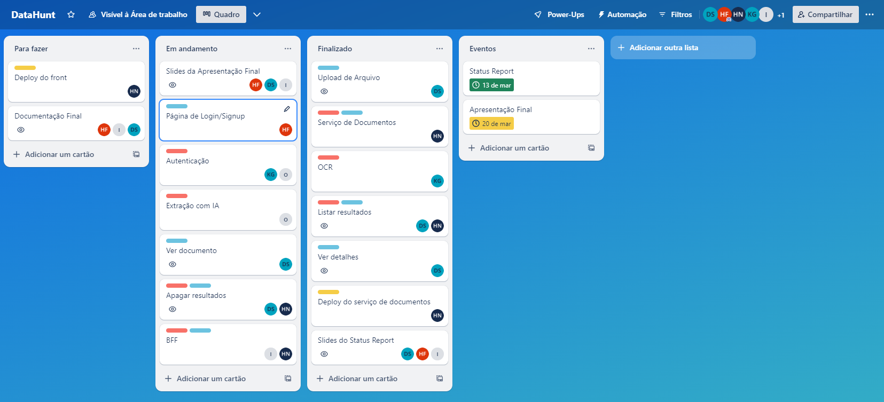
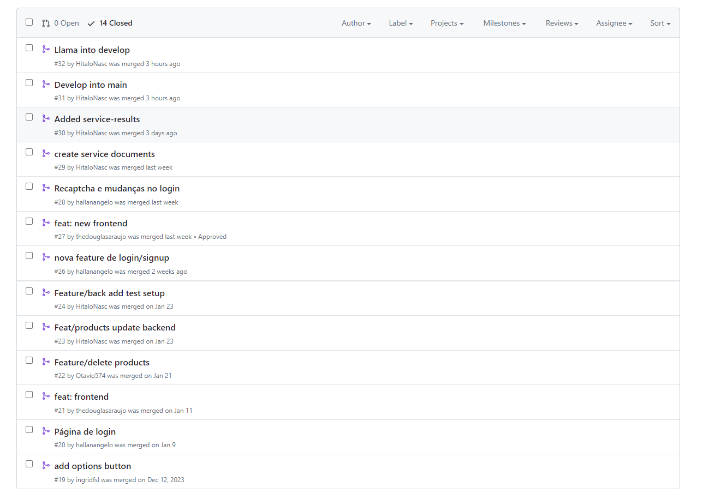
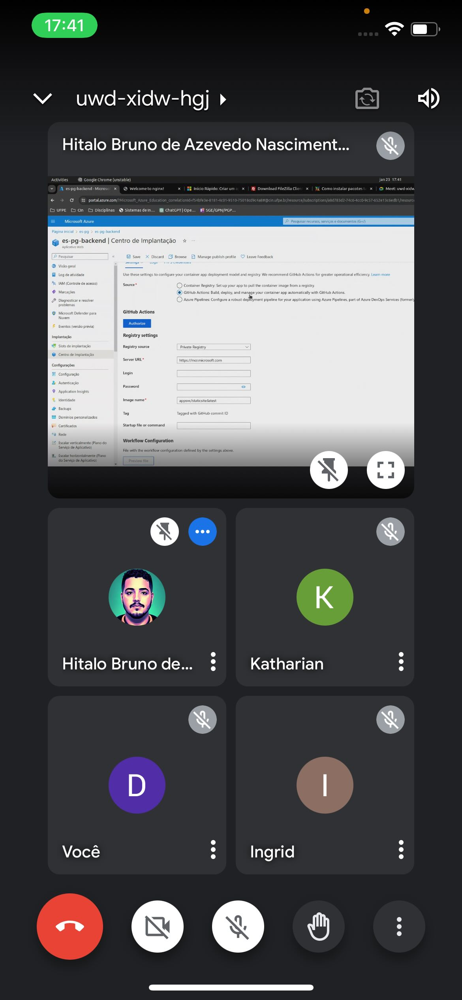
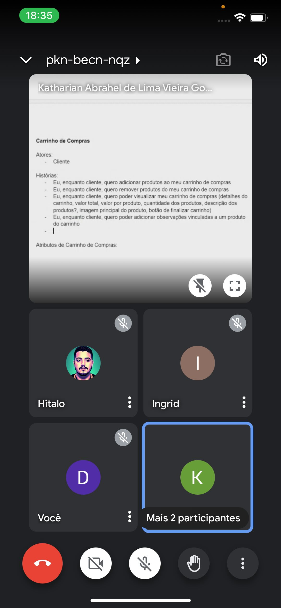
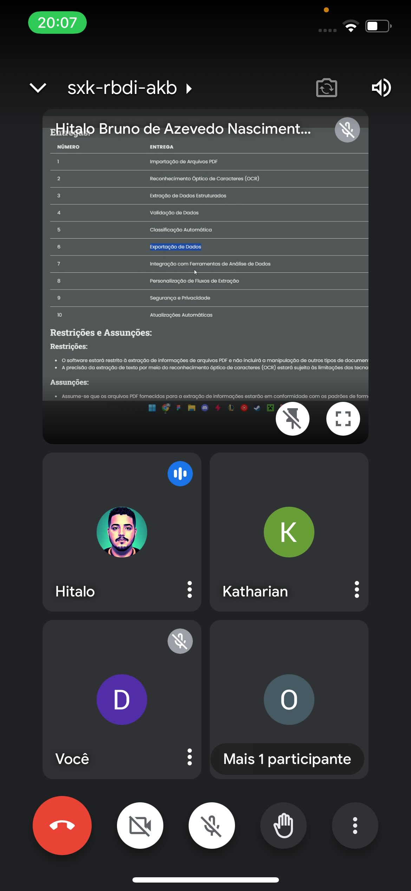
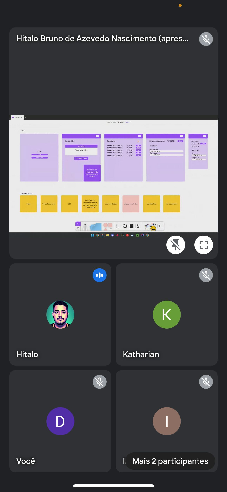

## Metodologia

No desenvolvimento do DataHunt, uma ferramenta para extração de metadados utilizando OCR e Inteligência Artificial, adotamos uma abordagem que combinou elementos do Scrum e do Kanban, incorporando o melhor de ambas as práticas e adaptando-as à nossa disponibilidade e tempo disponível para execução do projeto.

- **Planejamento e Ideação:**
  - No estágio inicial do nosso projeto, tínhamos como objetivo desenvolver um sistema PDV (ponto de venda) voltado para o gerenciamento de micronegócios. Contudo, após um consenso entre a equipe e validações realizadas com o professor orientador, decidimos por uma mudança de direção. Em vez de prosseguirmos com o desenvolvimento do sistema PDV, optamos por uma abordagem diferente, centrada no desenvolvimento do DataHunt. O DataHunt é uma ferramenta especializada em extração de dados, utilizando tecnologias como OCR (Reconhecimento Óptico de Caracteres) e Inteligência Artificial. Essa mudança foi motivada por uma série de fatores, incluindo insights adquiridos durante as etapas iniciais do projeto, bem como uma análise mais aprofundada das necessidades e oportunidades do mercado e do projeto em si.
  - Após essa mudança de direção, o projeto foi segmentado em etapas definidas, conforme delineado nas fases do planejamento, incluindo compreensão do contexto do problema, através do LAHM (Laboratório História e Memória da UFPE), definição do design e arquitetura a serem seguidos, prototipagem das intefraces, desenvolvimento da ferramenta e conclusão do projeto, com entrega de artefatos e documentação.
  - Cada etapa foi acompanhada de checkpoints definidos para garantir o progresso da equipe e o andamento da solução.

- **Estimativas e Execução:**
  - Realizamos estimativas de tempo para cada etapa, considerando a complexidade das tarefas e a disponibilidade de tempo.
  - Essas estimativas serviram como base para elaborar um planejamento no Trello e estabelecer prazos mais factíveis para cada fase de execução.

- **Acompanhamento e Monitoramento:**
  - Implementamos um método de acompanhamento e monitoramento constante do progresso e das atividades do projeto, com reuniões de atualização do projeto, às terças-feiras, para avaliar o andamento das atividades, o que seria desenvolvido até a próxima reunião e se há algum impedimento para isso.
  - Utilizamos ferramentas de gerenciamento de projetos, como Trello, a fim de facilitar a comunicação e o monitoramento das atividades dos integrantes do time.

## Ferramentas de Gestão e Acompanhamento de Projetos

Durante o projeto, empregamos ferramentas de gestão e acompanhamentos de projetos para facilitar a organização, comunicação, colaboração e monitoramento das tarefas.

- **Trello:**
  - O Trello foi utilizado para criar um quadro Kanbn que apresentava as tarefas em diferentes estágios (para fazer, em andamento e finalizado), possibilitando um melhor acompanhamento das atividades.
  

- **GitHub:**
  - O GitHub foi essencial para o versionamento e colaboração de código, permitindo que a equipe trabalhasse de maneira eficiente e monitorasse as mudanças que ocorriam no código e na documentação.
  

## Gestão de Equipes e Colaboração em Projetos de Software

No âmbito do projeto, a gestão de equipes e a colaboração desempenharam papéis fundamentais na eficiência e no sucesso da implementação do aplicativo.

- **Divisão de Tarefas:**
  - Optamos por uma divisão clara de atividades, com cada membro responsável por áreas específicas do desenvolvimento, como front-end (Douglas, Ingrid e Hallan) e back-end (Hítalo, Katharian e Otávio). Todos também auxiliavam nos testes e em sugestões de design e regras de negócio para a solução.

- **Comunicação Eficiente:**
  - Utilizamos canais de comunicação como WhatsApp, Discord e Google Meet para comunicação mais rápida entre os integrantes do time, facilitando uma solução mais ágil de questões.

- **Reuniões de Acompanhamento e Validação:**
  - Realizamos reuniões semanais de acompanhamento e validação, às terças-feiras, onde discutimos tudo o que foi produzido e tudo que estava programado para ser desenvolvido, a fim de acompanhar o progresso da solução e o alinhamento com os objetivos do projeto.

|  |  |  |  |
|----------------------------------------------|----------------------------------------------|----------------------------------------------|----------------------------------------------|
| *Reunião do dia 23 de janeiro - Debate sobre design e arquitetura do projeto*               | *Reunião do dia 30 de janeiro - Criação de histórias de usuários iniciais*               | *Reunião do dia 29 de fevereiro - Definição de outros aspectos do projeto (escopo, restrições, custos, prazos)*             | *Reunião do dia 06 de março - Revisão das funcionalidades e interfaces necessárias*                 |

## Considerações Finais

De maneira geral, a metodologia adotada para o desenvolvimento do DataHunt permitiu uma abordagem flexível e adaptável, combinando elementos do Scrum e do Kanban para proporcionar uma resolução mais rápida de problemas. Desde a decisão inicial de migrar do conceito de um sistema PDV para o desenvolvimento do DataHunt, até a implementação bem-sucedida de uma metodologia híbrida de gestão de projetos, cada passo foi marcado por aprendizado e colaboração intensiva. Através de um planejamento detalhado, estimativas realistas, acompanhamento constante e ferramentas eficazes de gestão e colaboração, nossa equipe conseguiu alcançar os objetivos do projeto de forma eficiente e satisfatória. O comprometimento com uma comunicação eficaz e a divisão clara de tarefas também desempenharam um papel essencial no sucesso da implementação do DataHunt.